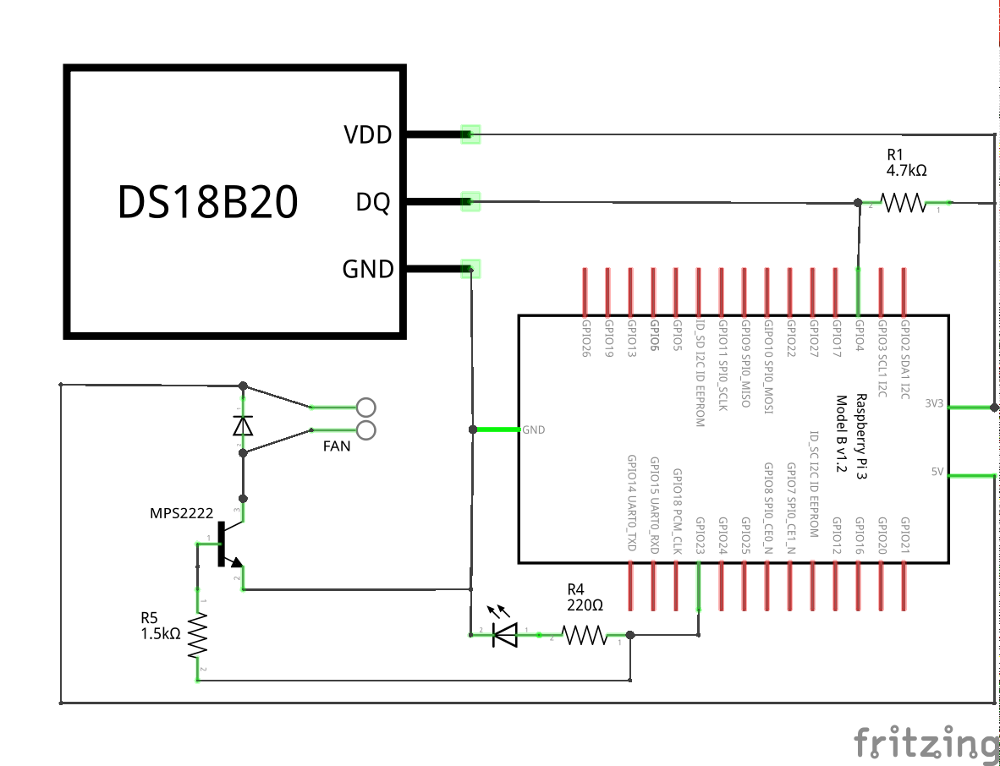

# Shipment Tracking System 

Shipment tracking dApp. This project explores Substrate Ink! Smart Contracts.

In the food industry, it is essential to have reliable records to trace each product back to the source and track conditions during the transportation phase.
It is incredibly difficult for customers or buyers to know the value of products because there is a significant lack of transparency in our current system.

This prototype tracks the package/parcel temperature and stores it on the blockchain.

## Prototype

The RaspberryPi has a Substrate light client node. It reads the temperature from an external sensor and records it on the blockchain. If the temperature exceeds a specific limit, the alarm will get recorded on the blockchain and a fan cools the package until the temperature goes down. This other variable could be helpful for insurance companies to have a trustful record of the facts. A smart contract could also handle an ERC20 token and pay for the damages if the conditions are met.

  

## Schematic

  

